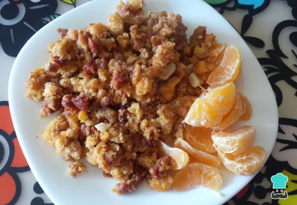
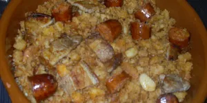
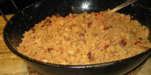
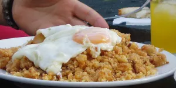
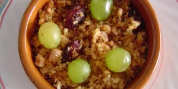
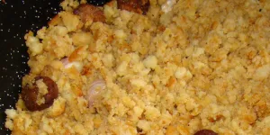
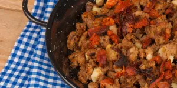

# Receta de Caldo de pollo sin verduras

Por Montse Morote Ortega, Bloguera cocinera, amante de la cocina de siempre: sencilla y casera.. 21 noviembre 2022

El **caldo de pollo casero** sin verduras consta de una deliciosa elaboración que sienta muy bien en los días de frío. Además, debes saber que preparar caldo es muy sencillo, solo debes tener buenos ingredientes, sobre todo, es importante que el pollo esté exquisito, sea bien fresco, de esta forma, te saldrá un buen caldo sin grasa y sin verduras. Si lo deseas, puedes hacer una buena olla de caldo y así tener para varios días, también se puede congelar en botes y tener en cualquier momento.

n RecetasGratis te enseñamos cómo hacer **caldo de pollo sin verduras.** ¡A cocinar!

La **receta de migas andaluzas** que te presento a continuación es una receta sencilla y práctica con la que conseguirás preparar las mejores migas. Presta atención y recuerda que la idea de este plato es darle utilidad al pan viejo, así que ve guardando todas las barras de pan que te sobren durante unos días.

| Comensales | Tiempo | Tipo de plato | Dificultad |
|------------|--------|---------------|------------|
| 👥4 comensales | 🕒1h 30 min | 🍽Principal | 📶Baja       |

| **Características adicionales**                                                                                   |
|--------------------------------------------------------------------------------------------------------------|
| Coste barato|

| Ingredientes para hacer Caldo de pollo sin verduras: | |
|-----------------------------------------------|------------------------------------------------|
| [ ] 2 litros de agua                  | [ ]  1 hueso salado                |
| [ ] 2 carcasas de pollo                     | [ ] 1 huesos de ternera                                       |
| [ ] 1 muslo                           | [ ] 1 pizca de sal                                        |

**También te puede interesar:** [Migas extremeñas caseras](https://www.recetasgratis.net/receta-de-migas-extremenas-caseras-60269.html)

### Cómo hacer Migas de Pan Andaluzas:
1. Antes de ponerte a cocinar migas, lo primero que debes hacer es **cortar el pan** en cuadritos pequeños, como si fueran picatostes. Esto lo puedes hacer con un cuchillo o directamente con las tijeras de cocina.

Recuerda que debes usar pan duro, viejo de al menos un día y, si es posible, utiliza siempre un pan que tenga una buena miga.

2. A la hora de cocinar, calienta una sartén con un buen chorro de aceite y empieza por sofreír los ajos troceados hasta que empiecen a dorarse.

3. A continuación, coloca toda la carne en la sartén, es decir, el chorizo, el bacon, el jamón dulce y la chistorra, y sofríe en conjunto. La idea es que el aceite vaya tomando el sabor de todos estos ingredientes.

La carne puedes comprarla ya cortada en tiras o sino, deberás cortarla tú mismo, todo en trozos pequeños, más o menos parecidos a los trozos de pan.

**Truco:** *Las migas de pan pueden llevar cualquier tipo de embutido.*

4. Cuando ya tengas este sofrito hecho, y veas que todo el embutido ha soltado su propio aceite, deberás añadir a la sartén un poco de agua con una pizca de sal.

La cantidad de agua es al gusto, pero de momento puedes empezar con un vaso pequeño.

5. Inmediatamente después, incorpora todos los trozos de pan viejo que has cortado y ve removiendo para que se empapen por completo con todo el aceite del sofrito y el agua.

Entonces, para terminar de cocinar nuestras migas andaluzas, deberás mantener la cocción a fuego medio-bajo y **remover de forma constante** hasta que se haya consumido todo el líquido.

El secreto de unas buenas migas de pan es remover todo sin parar, así evitamos que el pan se queme y conseguimos que este absorba bien los sabores de todo el embutido.

6. Espera que repose unos minutos y sirve este delicioso plato de invierno junto con unas uvas o mandarinas de guarnición. Esta **receta de migas andaluzas** es una versión fácil y rápida de la receta original, en la que normalmente se va sacando de la sartén todo el embutido una vez sofrito.

Otra versión de este famoso plato de comida española son las [migas de harina de trigo](https://www.recetasgratis.net/receta-de-migas-de-harina-de-trigo-59819.html). Y si te sigue sobrando pan también puedes ¡preparar un postre con pan viejo!, así que aquí tienes la receta de la [torta de pan colombiana](https://www.recetasgratis.net/receta-de-torta-de-pan-colombiana-17831.html). ¡Buen provecho!

Si te ha gustado la receta de **Migas de pan andaluzas**, te sugerimos que entres en nuestra categoría de [Recetas de Migas](https://www.recetasgratis.net/Migas-busqCate-1.html). También puedes visitar una selección de las mejores [recetas españolas](https://www.recetasgratis.net/recetas-espanolas) y [recetas andaluzas](https://www.recetasgratis.net/recetas-andaluzas).

[Migas extremeñas](https://www.recetasgratis.net/receta-de-las-originales-migas-extremenas-50605.html)

[Deliciosas Migas manchegas](https://www.recetasgratis.net/receta-de-deliciosas-migas-manchegas-50603.html)

[Migas con huevo flor](https://www.recetasgratis.net/receta-de-migas-con-huevo-flor-52230.html)

[Migas (Sierra de Huelva)](https://www.recetasgratis.net/receta-de-migas-sierra-de-huelva-25311.html)

[Exquisitas Migas de Aragón](https://www.recetasgratis.net/receta-de-exquisitas-migas-de-aragon-50608.html)

[Migas manchegas originales](https://www.recetasgratis.net/receta-de-migas-manchegas-originales-50604.html)

[Migas Ruleras](https://www.recetasgratis.net/receta-de-migas-ruleras-53470.html)

[Migas a la mariquilla](https://www.recetasgratis.net/receta-de-migas-a-la-mariquilla-33440.html)
